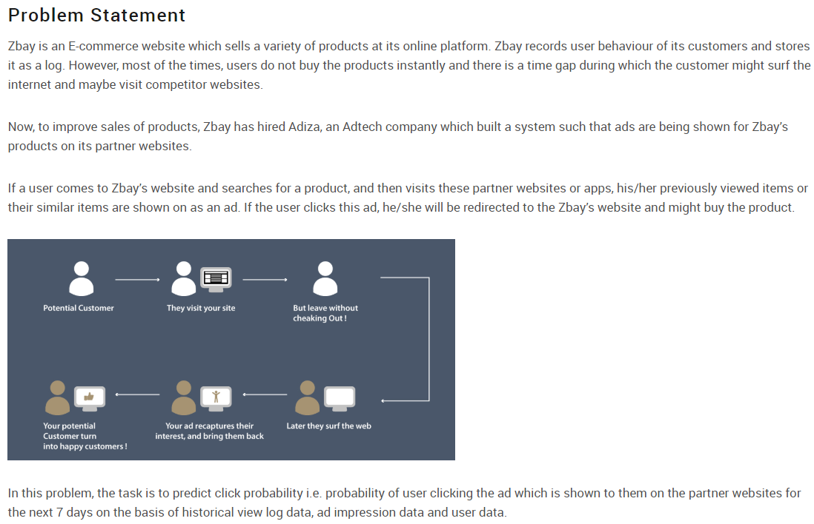
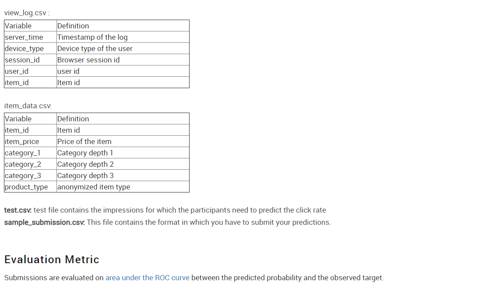

# AV WNS Analytics Wizard 2019

# Note
* **[user_agg.ipynb](user_agg.ipynb)**
This notebook extracts aggregation data for all users and saves them in csv file *user_agg.csv*

* **[Imp_agg.ipynb](Imp_agg.ipynb)**
This notebook extracts past user level aggreagtion data(all the log data before ad impression time) for all impression id's in train and test dataset and saves them in csv file *imp_agg.csv*

* **[Main.ipynb](Main.ipynb)**
This is the final solution that imports default datasets(train, test, view_log and item_data) as well as user and impression aggregation data which we prepared in above two notebooks. Also perform mean encoding(four fold cv with regularization alpha as 5) for features in train and test data. Finally built and tested ensemble models using RandomForest, CatBoost and LGBM. The final submission csv file is built using mean probability score from 10 fold cross validation of LGBM model.

# Leaderboard
(6.5K Participants)
* **[Public LB](https://datahack.analyticsvidhya.com/contest/wns-analytics-wizard-2019/lb)** : **317/836 Rank**
* **[Private LB](https://datahack.analyticsvidhya.com/contest/wns-analytics-wizard-2019/pvt_lb)** : **371/836 Rank**

### Incase of Github Rendering Issues with Jupyter notebboks, Please click the following links:
1. **[user_agg.ipynb](https://nbviewer.jupyter.org/github/jvmanobh/AV-WNS-Analytics-2019/blob/master/user_agg.ipynb)**
2. **[Imp_agg.ipynb](https://nbviewer.jupyter.org/github/jvmanobh/AV-WNS-Analytics-2019/blob/master/Imp_agg.ipynb)**
3. **[Main.ipynb](https://nbviewer.jupyter.org/github/jvmanobh/AV-WNS-Analytics-2019/blob/master/Main.ipynb)**
